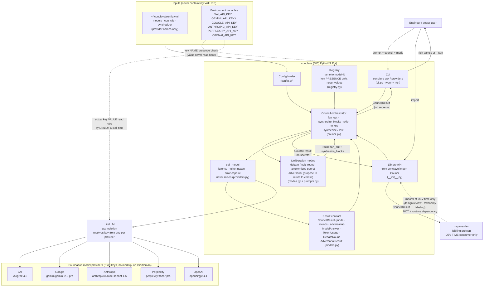

# conclave — System Context Diagram

This is one of conclave's three core docs (per the 3-Core Documentation Rule). It shows
the system context: how a user (or a downstream consumer) drives conclave, how config and
environment-variable keys feed in, how requests reach the five providers through LiteLLM,
and where the sibling **mcp-warden** project sits as a **dev-time** consumer.

> Authority note: behavioral details here are descriptive. The canonical spec is
> [`docs/PRODUCT_DESIGN_DOCUMENT.md`](docs/PRODUCT_DESIGN_DOCUMENT.md).

---

## System context

---

## Reading the diagram

- **Two entry points, one core.** The CLI (`cli.py`) and the library API
  (`from conclave import Council`) are both thin drivers over the same `Council`
  orchestrator. There is no behavior in the CLI that the library can't reach.
- **mcp-warden is dashed and dev-time.** The dotted edge from `mcp-warden` to the library
  is deliberate: warden imports conclave **only at design/eval time**. conclave is
  stochastic and must never sit in warden's deterministic runtime decision path. See PDD
  §10.
- **Two distinct env-var edges (the key-handling boundary).**
  - The **dotted edge from env to the registry** is a *presence check by name* — conclave
    asks "is `XAI_API_KEY` set and non-empty?" and never reads the value.
  - The **dotted edge from env to LiteLLM** is where the *actual key value* is read — by
    LiteLLM, at call time, never passing through a conclave data structure.
  This split is the core of conclave's "name-only" key posture (PDD §3).
- **Config carries no secrets.** `~/.conclave/config.yml` references providers by friendly
  name and model id only; it feeds names into the loader, never keys.
- **Results carry no secrets.** `CouncilResult` (prompt, answers, model ids, latency, token
  usage, errors) flows back to both the CLI and library consumers; it contains no key
  material, so `--json` and downstream serialization are safe.
- **Partial-failure is structural.** `call_model` converts any provider error into a
  `ModelAnswer.error` rather than raising, so one failing provider never aborts the run.
