# conclave — System Context Diagram

This is one of conclave's three core docs (per the 3-Core Documentation Rule). It shows
the system context: how a user (or a downstream consumer) drives conclave, how config and
environment-variable keys feed in, how requests reach the nine first-class providers through
conclave's own **provider highway** (an httpx transport + per-provider adapter registry — no
LLM-SDK dependency), how the v1.1 **verdict pipeline** turns the member answers into a
structured, agreement-scored, **auditable** verdict plus a redacted execution manifest, and
where the sibling **mcp-warden** project sits as a **dev-time** consumer.

> Authority note: behavioral details here are descriptive. The canonical spec is
> [`docs/PRODUCT_DESIGN_DOCUMENT.md`](docs/PRODUCT_DESIGN_DOCUMENT.md).

---

## System context

```mermaid
flowchart TB
    user["Engineer / power user"]
    warden["mcp-warden (sibling)<br/>DEV-TIME consumer only"]

    subgraph inputs["Inputs (never contain key VALUES)"]
        cfg["~/.conclave/config.yml<br/>models · councils · synthesizer · custom endpoints<br/>(provider names only)"]
        env["Environment variables<br/>XAI_API_KEY · GEMINI_API_KEY / GOOGLE_API_KEY<br/>ANTHROPIC_API_KEY · PERPLEXITY_API_KEY · OPENAI_API_KEY"]
    end

    subgraph conclave["conclave (MIT, Python 3.11+) — no LLM-SDK dependency"]
        cli["CLI · conclave ask / providers (cli.py)"]
        lib["Library API · from conclave import Council (__init__.py)"]
        council["Council orchestrator<br/>fan_out · synthesize_blocks · skip-no-key (council.py)"]
        modes["Deliberation modes<br/>debate · adversarial (modes.py + prompts.py)"]
        registry["Registry · name to model-id<br/>key PRESENCE only, never values (registry.py)"]
        config["Config loader · custom endpoints (config.py)"]
        models["Result contract · CouncilResult v2<br/>answers · verdict · consensus · manifest (models.py)"]
        provider["call_model<br/>resolve adapter · read key by name at call time<br/>output_contract · latency · usage · error redacted · never raises (providers.py)"]
        subgraph highway["Provider highway (owned, extensible)"]
            adreg["resolve_adapter (adapters/__init__.py)"]
            oai["OpenAICompatAdapter<br/>openai · xai · perplexity (+ custom)<br/>response_format json_schema"]
            anth["AnthropicAdapter<br/>/v1/messages · system-hoist · max_tokens<br/>tool input_schema"]
            gem["GeminiAdapter<br/>generateContent · role-map · usageMetadata<br/>responseSchema"]
            transport["transport.post_json<br/>single httpx async boundary (transport.py)"]
        end
        subgraph verdictpipe["Verdict pipeline (v1.1 · default-on)"]
            applyverdict["_apply_verdict<br/>buffered + streaming (council.py)"]
            extract["extract_verdict<br/>ONE call · cluster stances · repair-once · never raises (verdict_synthesis.py)"]
            agree["agreement.position_cluster_ratio_v1<br/>DETERMINISTIC arithmetic · no difflib · never LLM-emitted (agreement.py)"]
            verdictobj["CouncilVerdict<br/>positions + evidence_answer_ids · conflicts · provider_votes · minority_reports (verdict.py)"]
            manifest["ModelHarnessManifest<br/>first-class · secret-free · extraction provenance (manifest.py)"]
        end
    end

    subgraph providers["Foundation model providers (9 first-class, BYO keys, no markup, no middleman)"]
        grok["xAI · xai/grok-4.3"]
        gemini["Google · gemini/gemini-2.5-pro"]
        claude["Anthropic · anthropic/claude-sonnet-4-6"]
        perplexity["Perplexity · perplexity/sonar-pro"]
        openai["OpenAI · openai/gpt-4.1"]
        groq["Groq · groq/llama-3.3-70b-versatile"]
        deepseek["DeepSeek · deepseek/deepseek-chat"]
        mistral["Mistral · mistral/mistral-large-latest"]
        together["Together · together/Llama-3.3-70B-Instruct-Turbo"]
    end

    user -->|"prompt + council + mode"| cli
    user -->|"import"| lib
    warden -.->|"imports at DEV time only · NOT a runtime dep"| lib

    cfg --> config
    config --> council
    config -->|"custom endpoints"| adreg
    registry --> council
    env -.->|"key NAME presence check (value never read here)"| registry

    cli --> council
    lib --> council
    council --> modes
    modes -->|"reuse fan_out + synthesize_blocks"| council
    council --> provider
    provider --> adreg
    adreg --> oai
    adreg --> anth
    adreg --> gem
    oai --> transport
    anth --> transport
    gem --> transport
    provider -.->|"reads key VALUE by name at call time<br/>(transient · never stored/logged · redacted from errors)"| env
    transport --> grok
    transport --> gemini
    transport --> claude
    transport --> perplexity
    transport --> openai
    transport --> groq
    transport --> deepseek
    transport --> mistral
    transport --> together
    provider --> models

    council -->|"member answers ready"| applyverdict
    applyverdict -->|"synthesizer clusters stances<br/>(ONE extraction call, output_contract)"| extract
    extract -->|"clustering"| agree
    agree -->|"consensus_score/label<br/>(arithmetic over the clustering)"| verdictobj
    extract -->|"positions · conflicts · provider_votes"| verdictobj
    verdictobj -->|"hoisted to result mirrors"| models
    applyverdict -->|"records extractor model + prompt version<br/>(provenance) · re-runs secret-safety scan"| manifest
    manifest -->|"rides on every result"| models

    models --> council
    council -->|"CouncilResult (answers + verdict + manifest · no secrets)"| cli
    council -->|"CouncilResult (answers + verdict + manifest · no secrets)"| lib
    cli -->|"VERDICT panel + rich panels, or --json"| user
    lib -->|"CouncilResult"| warden
```

---

## Reading the diagram

- **Two entry points, one core.** The CLI (`cli.py`) and the library API
  (`from conclave import Council`) are both thin drivers over the same `Council`
  orchestrator. There is no behavior in the CLI that the library can't reach.
- **mcp-warden is dashed and dev-time.** The dotted edge from `mcp-warden` to the library
  is deliberate: warden imports conclave **only at design/eval time**. conclave is
  stochastic and must never sit in warden's deterministic runtime decision path. See PDD
  §10.
- **The provider highway is owned and extensible.** conclave has **no LLM-SDK dependency**;
  it talks to every provider through its own layer. `call_model` (`providers.py`) calls
  `resolve_adapter` (`adapters/__init__.py`), which selects a `ProviderAdapter` for the
  model id: `OpenAICompatAdapter` serves openai/xai/perplexity *and* any user-declared
  OpenAI-compatible endpoint; `AnthropicAdapter` speaks native `/v1/messages` (system
  prompt hoisted to the top-level `system` field, `max_tokens` required); `GeminiAdapter`
  speaks native `generateContent` (OpenAI roles mapped, `systemInstruction` hoisted,
  `usageMetadata` parsed). Every adapter builds a request and hands it to the **single**
  network boundary — `transport.post_json` (`transport.py`), one async httpx call site.
- **The verdict pipeline is default-on and auditable (PDD §4a).** Once the council has the
  member answers, `_apply_verdict` (`council.py`, run on both the buffered and streaming
  paths, *after* the manifest exists) drives `extract_verdict` (`verdict_synthesis.py`): a
  **single** extraction call asks the synthesizer model to *cluster* the members' stances —
  not to re-answer, and crucially **not to emit a number**. That clustering feeds
  `agreement.position_cluster_ratio_v1` (`agreement.py`), which computes the `consensus_score`
  as pure **deterministic arithmetic** (largest cluster / positioned members; no `difflib`,
  never model-emitted). The assembled `CouncilVerdict` (`verdict.py`) carries positions with
  `evidence_answer_ids`, `conflicts`, `provider_votes`, and `minority_reports`, and its values
  are hoisted to the `CouncilResult` v2 mirrors. The structured-output contract
  (`output_contract` → each adapter's native surface: OpenAI `response_format`, Anthropic
  tool `input_schema`, Gemini `responseSchema`) enforces the extraction schema at decode time,
  with a prompt-level fallback for providers without strict support. The **`ModelHarnessManifest`**
  (`manifest.py`) rides on **every** result — first-class, not a debug flag — recording which
  model + prompt version produced the clustering (provenance) and stamping `secret_safety`
  only after the serialized manifest is scanned clean. A verdict is *optional*: open-ended
  prompts, fewer than two responding members, or extraction failure leave `verdict = None`
  with the synthesis and member answers intact and the reason recorded on the manifest.
- **Streaming shares the same boundary (PDD §9 #5).** A `--stream` run (and the library
  `Council.ask_stream` async generator) flows through a streaming sibling of the call path:
  `call_model_stream` (`providers.py`) → `transport.stream_sse` (`transport.py`, the single
  streaming httpx call site, `client.stream(...)`) → each adapter's `stream_request` +
  `parse_sse_event` (OpenAI-compat `data:`/`[DONE]` deltas; Anthropic named SSE events;
  Gemini `streamGenerateContent?alt=sse`). `streaming.py` interleaves members concurrently
  and emits `StreamEvent`s, ending with a `done` event whose `CouncilResult` matches the
  non-streaming shape. Streaming covers `synthesize`/`raw` only; the never-raises +
  `redact()` invariants hold identically, with partial text preserved on mid-stream failure.
- **`resolve_adapter` is the extension seam.** Adding a *new provider family* is one
  registration in `adapters/__init__.py`; adding an *OpenAI-compatible endpoint* is
  **config-only** — a `~/.conclave/config.yml` `endpoints:` entry, no code. That is why
  `config` has an edge into the adapter registry on the diagram.
- **Two distinct env-var edges (the key-handling boundary).**
  - The **dotted edge from env to the registry** is a *presence check by name* — conclave
    asks "is `XAI_API_KEY` set and non-empty?" and never reads the value.
  - The **dotted edge from `call_model` to env** is where the *actual key value* is read —
    by `call_model` itself, **by name, at call time**, then passed to the adapter to build
    the auth header and sent by the transport. The value is **transient in-process: never
    stored on any object, never logged, never serialized, and scrubbed from error strings
    via `redact()`** (`adapters/base.py`). It never passes through a conclave data
    structure.
  This split is the core of conclave's "name-only" key posture (PDD §3).
- **Config carries no secrets.** `~/.conclave/config.yml` references providers by friendly
  name and model id only (and custom endpoints by URL + key-env-var *name*); it feeds names
  into the loader, never key values.
- **Results carry no secrets — and the manifest proves it.** `CouncilResult` (prompt,
  answers, model ids, latency, token usage, errors, the verdict, and the manifest) flows back
  to both the CLI and library consumers with no key material, so `--json` and downstream
  serialization are safe. The v1.1 manifest goes further: `secret_safety` is stamped
  `verified_no_secrets` only after `scan_for_secret_material()` proves the serialized manifest
  free of forbidden substrings (`sk-`/`bearer`/`authorization`/`api_key`/`x-api-key`).
- **Partial-failure is structural.** `call_model` converts any provider error into a
  `ModelAnswer.error` rather than raising, so one failing provider never aborts the run.
